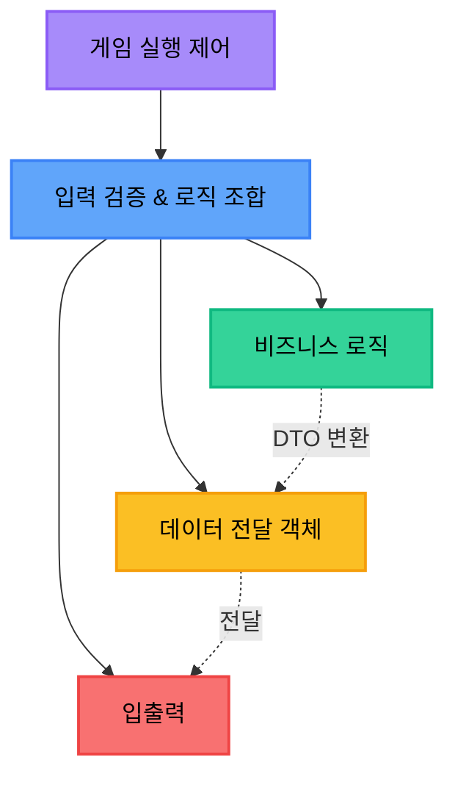
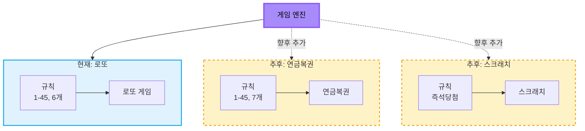
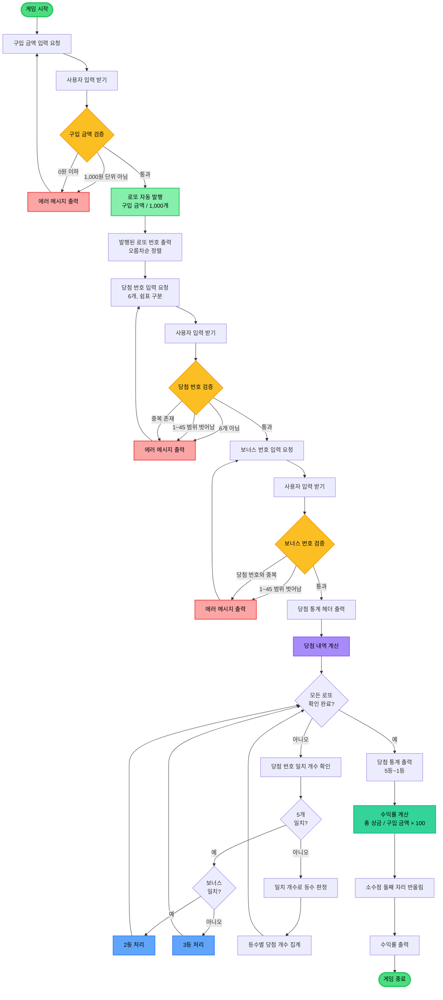
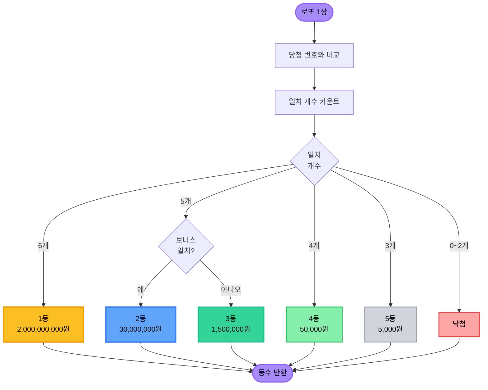
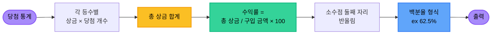

<div align="center">


</div>

<br>

## 📋 목차

<details open>
<summary>펼쳐서 전체 목차 보기</summary>

- [프로젝트 개요](#프로젝트-개요)
- [설계 고민](#설계-고민)
- [전체 게임 플로우](#전체-게임-플로우) 📊
- [구현할 기능 목록](#구현할-기능-목록) ⭐
- [과제 진행 요구 사항](#과제-진행-요구-사항)
- [기능 요구 사항](#기능-요구-사항)
- [입출력 요구 사항](#입출력-요구-사항)
  - [입력](#입력)
  - [출력](#출력)
- [실행 결과 예시](#실행-결과-예시)
- [프로그래밍 요구 사항](#프로그래밍-요구-사항)
  - [프로그래밍 요구 사항 1](#프로그래밍-요구-사항-1)
  - [프로그래밍 요구 사항 2](#프로그래밍-요구-사항-2)
  - [프로그래밍 요구 사항 3](#프로그래밍-요구-사항-3)
- [라이브러리](#라이브러리)

</details>

<br>

---

## 📋 프로젝트 개요

간단한 로또 발매기를 구현하는 미션입니다. 로또 번호 생성, 당첨 번호 입력, 당첨 내역 확인 및 수익률 계산 기능을 포함합니다.

<br>

---

## 🎨 설계 고민

- 불필요한 추상화보다는 단순하고 읽기 쉬운 코드 작성
- 객체는 데이터 노출보다 행동을 통한 협력 우선
- 게임 규칙의 변경과 확장 가능성 고려

### 프로그램 구조

게임 실행 제어가 전체 흐름을 관리하고, 각 계층은 명확한 책임을 가집니다. View는 Domain을 직접 알지 못하며, DTO를 통해 데이터를 전달받습니다.



### 확장 가능성

게임 규칙을 분리하여 관리함으로써, 향후 다른 복권 게임이 추가되어도 기존 코드 변경 없이 확장할 수 있습니다.



<br>

---

## 📊 전체 게임 플로우

로또 게임은 구입 금액 입력부터 수익률 출력까지 단계적으로 진행됩니다. 각 단계에서 검증 오류가 발생하면 해당 단계만 재입력받습니다.

<details>
<summary>📊 전체 게임 플로우차트 보기</summary>



</details>

<details>
<summary>🎯 당첨 확인 로직 보기</summary>



</details>

<details>
<summary>💰 수익률 계산 로직 보기</summary>



</details>

<br>

---

## 📝 구현할 기능 목록

### 1. 입력 기능

#### 1-1. 구입 금액 입력
- [ ] 사용자로부터 구입 금액 입력받기
- [ ] 구입 금액은 1,000원 단위여야 함
- [ ] 1,000원 미만 입력 불가
- [ ] 양의 정수만 허용 (0, 음수 불가)
- [ ] 잘못된 입력 시 에러 메시지 출력 후 재입력

#### 1-2. 당첨 번호 입력
- [ ] 사용자로부터 당첨 번호 입력받기 (쉼표로 구분된 6개의 숫자)
- [ ] 정확히 6개의 번호만 허용
- [ ] 각 번호는 1~45 범위여야 함
- [ ] 중복된 번호 입력 불가
- [ ] 잘못된 입력 시 에러 메시지 출력 후 재입력

#### 1-3. 보너스 번호 입력
- [ ] 사용자로부터 보너스 번호 입력받기
- [ ] 1~45 범위의 숫자여야 함
- [ ] 당첨 번호 6개와 중복 불가
- [ ] 잘못된 입력 시 에러 메시지 출력 후 재입력

### 2. 로또 발행 기능

#### 2-1. 로또 번호 생성
- [ ] 구입 금액에 따라 로또 구매 개수 계산 (금액 / 1,000원)
- [ ] 구매 개수만큼 로또 자동 생성
- [ ] 각 로또는 1~45 범위에서 중복 없이 6개 번호 생성
- [ ] 생성된 로또 번호 출력 (오름차순 정렬)

#### 2-2. Lotto 클래스 검증
- [ ] 로또 번호는 정확히 6개여야 함
- [ ] 각 번호는 1~45 범위여야 함
- [ ] 중복된 번호 불가

### 3. 당첨 확인 기능

#### 3-1. 당첨 내역 계산
- [ ] 각 로또의 당첨 번호 일치 개수 확인
- [ ] 5개 일치 시 보너스 번호 포함 여부 확인
- [ ] 당첨 등수 판정
  - 6개 일치 → 1등 (2,000,000,000원)
  - 5개 일치 + 보너스 일치 → 2등 (30,000,000원)
  - 5개 일치 → 3등 (1,500,000원)
  - 4개 일치 → 4등 (50,000원)
  - 3개 일치 → 5등 (5,000원)
- [ ] 등수별 당첨 개수 집계

#### 3-2. 수익률 계산
- [ ] 총 상금 계산 (각 등수별 당첨 개수 × 상금)
- [ ] 수익률 계산 ((총 상금 / 구입 금액) × 100)
- [ ] 소수점 첫째 자리까지 표시 (둘째 자리에서 반올림)

### 4. 출력 기능

#### 4-1. 구매 로또 출력
- [x] 구매한 로또 개수 출력
- [x] 각 로또 번호를 오름차순으로 정렬하여 출력
- [x] 출력 형식: [8, 21, 23, 41, 42, 43]

#### 4-2. 당첨 통계 출력
- [x] "당첨 통계" 헤더 출력
- [x] 구분선(---) 출력
- [x] 5등부터 1등까지 순서대로 출력
- [x] 출력 형식: "3개 일치 (5,000원) - 1개"
- [x] 당첨되지 않은 등수도 "0개"로 표시
- [x] 금액은 천 단위 쉼표 포함

#### 4-3. 수익률 출력
- [x] 총 수익률 출력
- [x] 출력 형식: "총 수익률은 62.5%입니다."

### 5. 예외 처리

#### 5-1. 에러 메시지
- [x] 모든 에러 메시지는 "[ERROR]"로 시작
- [x] 구입 금액이 1,000원 단위가 아닐 때
- [x] 로또 번호가 1~45 범위를 벗어날 때
- [x] 로또 번호에 중복이 있을 때
- [x] 보너스 번호가 당첨 번호와 중복될 때

#### 5-2. 재입력 처리
- [ ] 구입 금액 오류 시 구입 금액만 재입력
- [ ] 당첨 번호 오류 시 당첨 번호만 재입력
- [ ] 보너스 번호 오류 시 보너스 번호만 재입력
- [ ] 예외 발생 후 프로그램 종료하지 않고 계속 진행

<br>

---

## ✅ 과제 진행 요구 사항

- 미션은 [로또 저장소](https://github.com/woowacourse-precourse/java-lotto-7)를 포크하고 클론하는 것으로 시작한다.
- **기능을 구현하기 전 `README.md`에 구현할 기능 목록을 정리**해 추가한다.
- **Git의 커밋 단위는 앞 단계에서 `README.md`에 정리한 기능 목록 단위**로 추가한다.
- [AngularJS Git Commit Message Conventions](https://gist.github.com/stephenparish/9941e89d80e2bc58a153)을 참고해 커밋 메시지를 작성한다.
- 자세한 과제 진행 방법은 [프리코스 진행 가이드](https://github.com/woowacourse/woowacourse-docs/tree/master/precourse) 문서를 참고한다.

<br>

---

## ✨ 기능 요구 사항

간단한 로또 발매기를 구현한다.

- 로또 번호의 숫자 범위는 **1~45**까지이다.
- **1개의 로또**를 발행할 때 중복되지 않는 **6개의 숫자**를 뽑는다.
- **당첨 번호 추첨** 시 중복되지 않는 숫자 6개와 **보너스 번호 1개**를 뽑는다.
- 당첨은 1등부터 5등까지 있다. **당첨 기준과 금액**은 아래와 같다.
  - **1등**: 6개 번호 일치 / 2,000,000,000원
  - **2등**: 5개 번호 + 보너스 번호 일치 / 30,000,000원
  - **3등**: 5개 번호 일치 / 1,500,000원
  - **4등**: 4개 번호 일치 / 50,000원
  - **5등**: 3개 번호 일치 / 5,000원
- 로또 구입 금액을 입력하면 구입 금액에 해당하는 만큼 로또를 발행해야 한다.
  - **로또 1장의 가격은 1,000원**이다.
- 당첨 번호와 보너스 번호를 입력받는다.
- 사용자가 구매한 로또 번호와 당첨 번호를 비교하여 **당첨 내역 및 수익률**을 출력하고 로또 게임을 종료한다.
- 사용자가 잘못된 값을 입력할 경우 `IllegalArgumentException`을 발생시키고, **"[ERROR]"로 시작하는 에러 메시지**를 출력 후 그 부분부터 입력을 다시 받는다.
  - `Exception`이 아닌 `IllegalArgumentException`, `IllegalStateException` 등과 같은 **명확한 유형**을 처리한다.

<br>

---

## 📥📤 입출력 요구 사항

### 입력

**로또 구입 금액**을 입력 받는다. 구입 금액은 1,000원 단위로 입력 받으며 1,000원으로 나누어 떨어지지 않는 경우 예외 처리한다.

```
14000
```

**당첨 번호**를 입력 받는다. 번호는 쉼표(`,`)를 기준으로 구분한다.

```
1,2,3,4,5,6
```

**보너스 번호**를 입력 받는다.

```
7
```

### 출력

**발행한 로또 수량 및 번호**를 출력한다. 로또 번호는 **오름차순**으로 정렬하여 보여준다.

```
8개를 구매했습니다.
[8, 21, 23, 41, 42, 43]
[3, 5, 11, 16, 32, 38]
[7, 11, 16, 35, 36, 44]
[1, 8, 11, 31, 41, 42]
[13, 14, 16, 38, 42, 45]
[7, 11, 30, 40, 42, 43]
[2, 13, 22, 32, 38, 45]
[1, 3, 5, 14, 22, 45]
```

**당첨 내역**을 출력한다.

```
3개 일치 (5,000원) - 1개
4개 일치 (50,000원) - 0개
5개 일치 (1,500,000원) - 0개
5개 일치, 보너스 볼 일치 (30,000,000원) - 0개
6개 일치 (2,000,000,000원) - 0개
```

**수익률**은 소수점 둘째 자리에서 반올림한다. (ex. 100.0%, 51.5%, 1,000,000.0%)

```
총 수익률은 62.5%입니다.
```

**예외 상황** 시 에러 문구를 출력해야 한다. 단, 에러 문구는 "[ERROR]"로 시작해야 한다.

```
[ERROR] 로또 번호는 1부터 45 사이의 숫자여야 합니다.
```

<br>

---

## 💻 실행 결과 예시

```
구입금액을 입력해 주세요.
8000

8개를 구매했습니다.
[8, 21, 23, 41, 42, 43]
[3, 5, 11, 16, 32, 38]
[7, 11, 16, 35, 36, 44]
[1, 8, 11, 31, 41, 42]
[13, 14, 16, 38, 42, 45]
[7, 11, 30, 40, 42, 43]
[2, 13, 22, 32, 38, 45]
[1, 3, 5, 14, 22, 45]

당첨 번호를 입력해 주세요.
1,2,3,4,5,6

보너스 번호를 입력해 주세요.
7

당첨 통계
---
3개 일치 (5,000원) - 1개
4개 일치 (50,000원) - 0개
5개 일치 (1,500,000원) - 0개
5개 일치, 보너스 볼 일치 (30,000,000원) - 0개
6개 일치 (2,000,000,000원) - 0개
총 수익률은 62.5%입니다.
```

<br>

---

## ⚙️ 프로그래밍 요구 사항

### 프로그래밍 요구 사항 1

- JDK 21 버전에서 실행 가능해야 한다.
- 프로그램 실행의 시작점은 `Application`의 `main()`이다.
- `build.gradle` 파일은 변경할 수 없으며, 제공된 라이브러리 이외의 외부 라이브러리는 사용하지 않는다.
- 프로그램 종료 시 `System.exit()`를 호출하지 않는다.
- 프로그래밍 요구 사항에서 달리 명시하지 않는 한 파일, 패키지 등의 이름을 바꾸거나 이동하지 않는다.
- 자바 코드 컨벤션을 지키면서 프로그래밍한다.
  - 기본적으로 [Java Style Guide](https://google.github.io/styleguide/javaguide.html)를 원칙으로 한다.

### 프로그래밍 요구 사항 2

- **indent(인덴트, 들여쓰기) depth를 3이 넘지 않도록 구현한다. 2까지만 허용한다.**
  - 예를 들어 while문 안에 if문이 있으면 들여쓰기는 2이다.
  - 힌트: indent(인덴트, 들여쓰기) depth를 줄이는 좋은 방법은 함수(또는 메서드)를 분리하면 된다.
- **3항 연산자를 쓰지 않는다.**
- 함수(또는 메서드)가 한 가지 일만 하도록 최대한 작게 만들어라.
- JUnit 5와 AssertJ를 이용하여 정리한 기능 목록이 정상적으로 작동하는지 테스트 코드로 확인한다.
  - 테스트 도구 사용법이 익숙하지 않다면 아래 문서를 참고하여 학습한 후 테스트를 구현한다.
    - [JUnit 5 User Guide](https://junit.org/junit5/docs/current/user-guide/)
    - [AssertJ User Guide](https://assertj.github.io/doc/)
    - [AssertJ Exception Assertions](https://www.baeldung.com/assertj-exception-assertion)
    - [Guide to JUnit 5 Parameterized Tests](https://www.baeldung.com/parameterized-tests-junit-5)

### 프로그래밍 요구 사항 3

- **함수(또는 메서드)의 길이가 15라인을 넘어가지 않도록 구현한다.**
  - 함수(또는 메서드)가 한 가지 일만 잘 하도록 구현한다.
- **else 예약어를 쓰지 않는다.**
  - else를 쓰지 말라고 하니 switch/case로 구현하는 경우가 있는데 switch/case도 허용하지 않는다.
  - 힌트: if 조건절에서 값을 return하는 방식으로 구현하면 else를 사용하지 않아도 된다.
- **Java Enum을 적용하여 프로그램을 구현한다.**
- 구현한 기능에 대한 **단위 테스트를 작성**한다. 단, UI(System.out, System.in, Scanner) 로직은 제외한다.
  - 단위 테스트 작성이 익숙하지 않다면 `LottoTest`를 참고하여 학습한 후 테스트를 작성한다.

<br>

---

## 📚 라이브러리

`camp.nextstep.edu.missionutils`에서 제공하는 `Randoms` 및 `Console` API를 사용하여 구현해야 한다.

- Random 값 추출은 `camp.nextstep.edu.missionutils.Randoms`의 `pickUniqueNumbersInRange()`를 활용한다.
- 사용자가 입력하는 값은 `camp.nextstep.edu.missionutils.Console`의 `readLine()`을 활용한다.

### 사용 예시

```java
// 1에서 45 사이의 중복되지 않은 정수 6개 반환
Randoms.pickUniqueNumbersInRange(1, 45, 6);
```

<br>

---

<div align="center">


</div>
